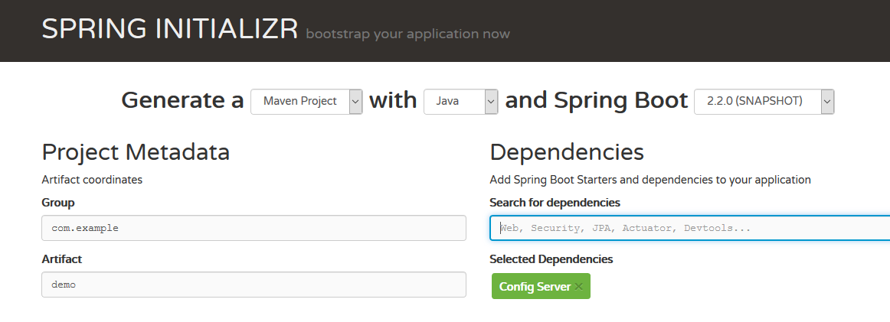

## Servidor Configuraciones en Spring Cloud

En esta ocasión vamos a usar el paquete **Spring Cloud Config** para poder tener configuraciones remotas para nuestras aplicaciones.

La idea es que nuestro programa o programas puedan ir a buscar sus parámetros de configuración a un lugar externo, de tal manera  que nuestra aplicación sea fácilmente parametrizable e incluso se puedan cambiar sus configuraciones en caliente.

Esto se utiliza ampliamente en _microservicios_ pues una mismo servicio o aplicación puede estar lanzada muchas veces en diferentes _contenedores_ y es interesante tener un lugar central desde donde se puedan aplicar las configuraciones a estos servicios.

Para ello vamos a crear un servidor de configuraciones y un cliente que buscara su configuración en ese servidor. 

El servidor de configuraciones, usara un repositorio GIT de GitHub donde estarán los ficheros de configuración.

Los datos de las aplicaciones serán los siguientes.

##### - Servidor de configuraciones

- **Proyecto**: config-server
- **Puerto**: 8888
- **Nombre Spring** : config-server
- **Servidor GIT**: https://github.com/chuchip/servercloudconfig.git

##### - Cliente de configuraciones

- **Proyecto**: config-client
- **Puerto**: 8080
- **Nombre Spring**:  config-client

Los fuentes de los programas están en:  https://github.com/chuchip/servercloudconfig


1. #### Servidor de configuraciones

La única  dependencia para poder crear un servidor de configuraciones es incluir este paquete  en nuestro proyecto **maven**

```
<dependency>
	<groupId>org.springframework.cloud</groupId>
	<artifactId>spring-cloud-config-server</artifactId>
</dependency>
```

El starter de Spring seria **Config Server**



El servidor de configuraciones se compone de una sola clase, que detallo a continuación:

```java
package com.profesorp.configserver;

import org.springframework.boot.SpringApplication;
import org.springframework.boot.autoconfigure.SpringBootApplication;
import org.springframework.cloud.config.server.EnableConfigServer;

@EnableConfigServer
@SpringBootApplication
public class ConfigServerApplication {

	public static void main(String[] args) {
		SpringApplication.run(ConfigServerApplication.class, args);
	}
}

```

Como se ve, lo único destacable es la anotación **@EnableConfigServer** . Esta aplicación 


Las peticiones para ver las variables definidas deberán ser lanzadas a 
http://localhost:8888/NOMBRE_APLICACION/PERFIL 
Donde `NOMBRE_APLICACION` debera ser el configurado en la propiedad `spring.application.name`

Esto buscara en el repositorio GIT el fichero "NOMBRE_APLICACION.properties" del


El fichero **bootstrap.properties**  sustitura a **config.properties**.

Se deberá poner el nombre de la aplicación con la propiedad: `spring.application.name` 
Ese será el fichero _properties_ que buscara en el repositorio git del servidor de configuraciones.

Si existe la propiedad `spring.cloud.config.name=capitales-ms`se utilizara esta variable en vez de `spring.application.name`

Si el nombre de la aplicación o de la variable spring.cloud.config.name es **capitales-service**, la petición será lanzada a [http://localhost:8888/capitales-service/default](http://localhost:8888/capitales-service/default)

Si la variable `spring.profiles.active` en **bootstrap.properties**  es igual a `qa`  la peticion se lanzaria a [http://localhost:8888/capitales-service/qa](http://localhost:8888/capitales-service/qa)

Las variables buscadas seran las especificadas por la etiqueta `@ConfigurationProperties`.

Por ejemplo,si la etiqueta es `@ConfigurationProperties(@ConfigurationProperties("capitales-service")` y el nombre de la aplicación es **paises-config-cliente**, en el servidor GIT buscara el fichero `paises-config-client.properties` y dentro de él las variables que empiecen por **capitales-service** como

```
capitales-service.idiomaDefecto: es-ES
capitales-service.maxResultados: 40
```

